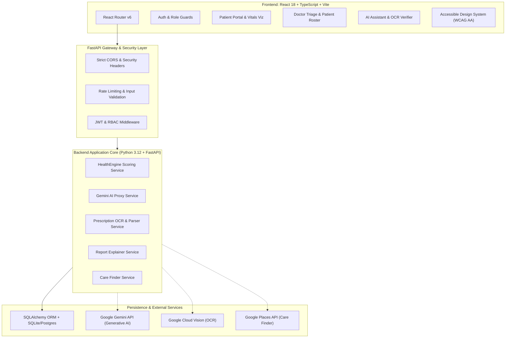

# Healthcare AI — Architecture and Migration Plan

## 1. Existing Legacy Architecture Analysis (PySide6 Prototype)

### 1.1 Legacy System Characteristics
The original prototype `final Hackthon.py` was constructed as a single-tier desktop application using **PySide6 (Qt for Python)**.
* **Presentation Tier**: QMainWindow, QStackedWidget, QTabWidget, custom QDialogs, and basic stylesheet CSS (`qss`).
* **Persistence Tier**: Direct synchronous SQLite queries using raw `sqlite3` driver queries, with minimal foreign key enforcement or connection isolation.
* **Business Logic**: Tightly coupled inside Qt event loop handlers (slots and signal connections), making headless automated testing or unit testing impractical.
* **External Integrations**: Synchronous blocking HTTP requests or Python SDK calls to Gemini API and Google Cloud Vision, causing desktop UI freezing during latency spikes.
* **Security & Auth**: Client-side role switching without cryptographically signed server tokens; plain text passwords or rudimentary MD5 hashes; no Protected Health Information (PHI) access control auditing.

---

## 2. Feature Inventory

| Area | Feature in Legacy App | Status & Migration Approach |
| :--- | :--- | :--- |
| **Authentication** | Username/Password login dialog; role radio buttons (Doctor/Patient) | Migrated to secure REST auth (`/api/v1/auth/login`) with bcrypt, JWT bearer tokens, and HttpOnly cookie support. |
| **Vitals Logging** | QFormLayout inputting HR, Sugar, BP, Temp, SpO2 | Migrated to validated Pydantic schema (`/api/v1/patient/vitals`), client-side instant validation, and SVG/Recharts health trend visualization. |
| **HealthEngine** | Hardcoded score deduction rules in GUI controller | Extracted into pure, deterministic backend service (`app.services.healthengine`) with 100% unit test coverage. |
| **Patient Dashboard** | QTabWidget showing Vitals, Meds, Appointments, Reports | Transformed into responsive React 18 SPA with accessible tabs, summary metric cards, and emergency indicators. |
| **Doctor Dashboard** | Patient QTableWidget with raw list | Upgraded into clinical roster with search, filter, patient detail drilldown, and risk-prioritized triage queue. |
| **AI Health Assistant**| Chat QListWidget calling Gemini API | Migrated to backend streaming/REST proxy (`/api/v1/ai/chat`) with prompt sanitization, rate limiting, and medical disclaimer injection. |
| **Prescription AI** | QFileDialog image picker + Google Cloud Vision OCR | Migrated to secure multipart upload (`/api/v1/prescription/upload`), OCR extraction, structured medication parsing, and human-in-the-loop verification UI. |
| **Medical Report AI** | PDF/Image upload + Gemini text summarizer | Backend extraction service with OCR, plain-language translation, lab range disclaimer, and download/print capability. |
| **Medicine Explainer**| Text search box calling Gemini for drug info | Dedicated service (`/api/v1/ai/explain-medicine`) returning structured educational explanations with side-effect caveats. |
| **Care Finder** | Google Places API query for nearby clinics | Backend proxy (`/api/v1/care-finder/search`) handling coordinates or textual location queries, with robust mock fallback. |

---

## 3. Existing Business Rules — HealthEngine Scoring Engine

The HealthEngine deterministically calculates a baseline health score from 5 vital signs.

### Baseline & Bounds
* **Initial Score**: `100` points
* **Floor**: `0` points
* **Ceiling**: `100` points

### Deduction Rules Matrix
| Vital Parameter | Healthy Range | Condition Trigger | Deduction | Severity Rationale |
| :--- | :--- | :--- | :--- | :--- |
| **Heart Rate** | 50 – 110 bpm | `< 50` OR `> 110` bpm | **-18 points** | Bradycardia or Tachycardia |
| **Blood Sugar** | 70 – 180 mg/dL | `< 70` OR `> 180` mg/dL | **-18 points** | Hypoglycemia or Hyperglycemia |
| **Blood Pressure** | Sys < 140 & Dia < 90 mmHg | `Sys >= 140` OR `Dia >= 90` | **-18 points** | Stage 1/2 Hypertension or Crisis |
| **Body Temperature** | < 38.0 °C (100.4 °F) | `>= 38.0 °C` | **-12 points** | Febrile / Pyrexia indication |
| **Oxygen Saturation (SpO2)**| >= 94% | `< 94%` | **-22 points** | Hypoxemia (critical oxygenation deficit) |

### Stratification Categories
* **LOW Risk**: Score `85` – `100` (Vitals within stable physiological thresholds).
* **MODERATE Risk**: Score `65` – `84` (Mild to moderate vital anomalies requiring routine observation).
* **HIGH Risk**: Score `< 65` (Multiple significant physiological deviations; prioritized in Doctor Triage Queue).

---

## 4. Proposed Modern Web Architecture

---

## 5. Feature-to-Module Mapping

| Feature | Backend Component | Frontend Component |
| :--- | :--- | :--- |
| **Authentication & RBAC** | `app/api/routes/auth.py`, `app/core/security.py` | `src/features/authentication/LoginForm.tsx`, `RegisterForm.tsx` |
| **HealthEngine** | `app/services/healthengine.py` | `src/features/vitals/HealthEngineScoreCard.tsx` |
| **Vitals Tracking** | `app/api/routes/patient.py`, `app/models/vitals.py` | `src/features/vitals/VitalsLoggingModal.tsx`, `VitalsChart.tsx` |
| **Doctor Triage** | `app/api/routes/doctor.py` | `src/features/doctor/DoctorTriageQueue.tsx`, `PatientDetailModal.tsx` |
| **Appointments** | `app/api/routes/appointments.py`, `app/models/appointment.py` | `src/features/appointments/AppointmentManager.tsx` |
| **Medications** | `app/api/routes/medicines.py`, `app/models/medicine.py` | `src/features/medicines/MedicineTracker.tsx` |
| **Prescription AI** | `app/services/prescription_service.py` | `src/features/prescription/PrescriptionUploader.tsx` |
| **Report Explainer** | `app/services/report_service.py` | `src/features/reports/ReportExplainerView.tsx` |
| **AI Assistant** | `app/services/ai_service.py`, `app/api/routes/ai.py` | `src/features/ai-assistant/AIAssistantChat.tsx` |
| **Care Finder** | `app/services/places_service.py` | `src/features/care-finder/CareFinderView.tsx` |

---

## 6. Security & Privacy Risks in Legacy Code and Mitigations

| # | Legacy Vulnerability | Risk | Modern Mitigation |
| :--- | :--- | :--- | :--- |
| 1 | Hardcoded API keys in Python script | Leakage of Gemini / Cloud credentials | Centralized Pydantic settings loading from `.env`; secrets omitted from frontend. |
| 2 | Insecure Direct Object References (IDOR) | Patients viewing other patients' reports | Strict server-side tenancy checking (`WHERE patient_id == current_user.id`). |
| 3 | Arbitrary local file access via desktop dialog | Server-Side Request Forgery / Local File Inclusion | Multipart upload validation (file type sniffing, size limit <= 10MB, safe UUID storage). |
| 4 | Plaintext / Unhashed Passwords | Account credential compromise | Password hashing using `bcrypt` (12 rounds) with salted hashes. |
| 5 | Unrestricted AI medical advice | Clinical liability and patient misinformation | Clear disclaimers injected into both system prompts and client-side UI badges. |
| 6 | Unvalidated OCR automated prescriptions | Potential toxic dosages entered automatically | Mandatory human verification required before any parsed prescription is saved. |

---

## 7. Features that Cannot Be Migrated Exactly

1. **Native OS File Pickers (`QFileDialog`)**: Migrated to HTML5 Drag-and-Drop file uploader with mime-type checking and file size caps.
2. **Synchronous Desktop Modals (`QMessageBox.exec()`)**: Migrated to accessible React dialogs supporting ARIA focus traps, keyboard `Escape` dismiss, and backdrop blur.
3. **Local Text-to-Speech (`pyttsx3`)**: Migrated to browser-native `window.speechSynthesis` API with consent prompt, eliminating platform-specific native C++ audio libraries.
4. **Desktop System Tray Notifications**: Migrated to in-app toast notification feed and accessible ARIA live regions.
