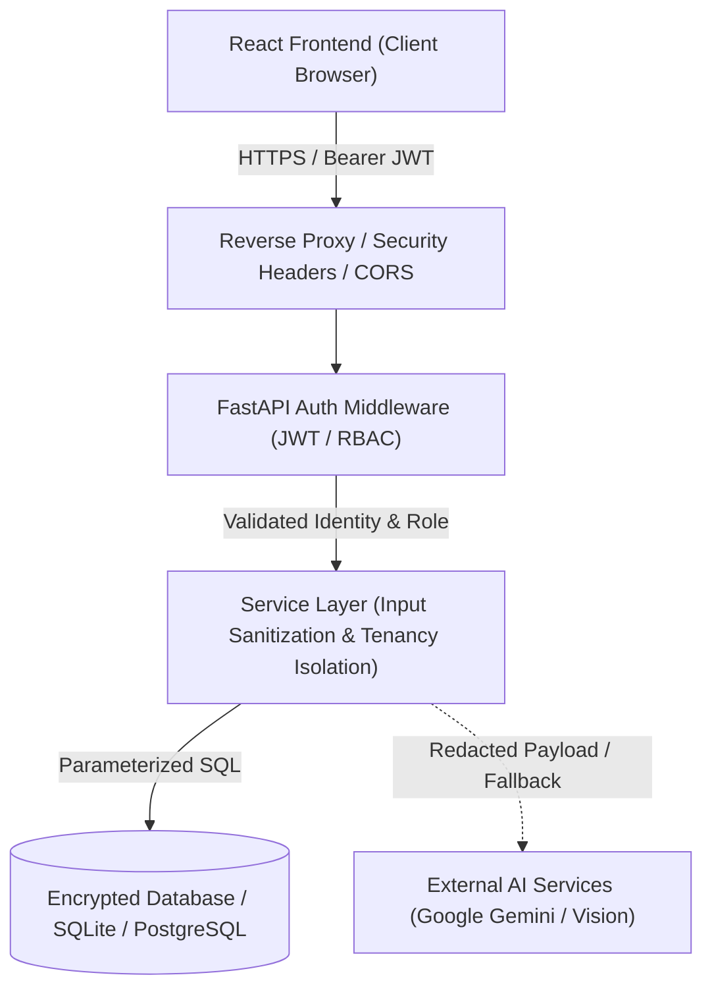

# Healthcare AI — Security & Privacy Architecture

## 1. Security Architecture Overview

The Healthcare AI Platform treats all health information, vital signs, prescriptions, and medical reports as **Protected Health Information (PHI)** requiring defense-in-depth security controls.

---

## 2. Threat Modeling & Trust Boundaries

### 2.1 Trust Boundaries
1. **Untrusted Client Boundary**: Any incoming HTTP request, query parameter, or file upload is considered hostile until validated against Pydantic schemas.
2. **Inter-User Isolation Boundary**: Patients must never have read or write access to data records belonging to other patients.
3. **Role Boundary**: Doctors possess elevated privileges to view assigned patients and triage queues, but cannot modify arbitrary system settings or act as administrative root.
4. **Third-Party AI Boundary**: User queries sent to external LLMs (Google Gemini) are sanitized to prevent secret leaks and injection attacks.

---

## 3. Core Security Controls

### 3.1 Authentication & Authorization
* **Password Hashing**: Passwords stored using `bcrypt` with automatic salting. Plaintext passwords never logged or returned.
* **Token Standard**: JSON Web Tokens (JWT) signed using HMAC-SHA256 (`HS256`) with a cryptographically random secret key.
* **Role-Based Access Control (RBAC)**: Every API endpoint is decorated with FastAPI dependencies:
  * `require_role(["patient"])`
  * `require_role(["doctor"])`
  * `require_role(["patient", "doctor"])`
* **Tenancy & IDOR Prevention**: Queries for patient-specific resources explicitly assert `patient_id == current_user.id` when invoked by a patient.

### 3.2 File Upload & Input Security
* **MIME-Type & Extension Whitelisting**: Restricted to `.pdf`, `.png`, `.jpg`, `.jpeg`.
* **File Size Quotas**: Maximum file size strictly capped at 10 MB.
* **Path Traversal Protection**: Uploaded files are renamed to UUIDv4 identifiers before storage on disk; original filenames are sanitized.
* **No File Execution**: Upload directory is configured with execution disabled.

### 3.3 API Security & Injection Defense
* **SQL Injection**: Prevented via SQLAlchemy ORM parameterized query generation.
* **Cross-Site Scripting (XSS)**: Untrusted text and AI outputs are escaped and rendered as text, never raw unescaped HTML.
* **CORS Policy**: Configured to permit only explicitly designated origins (`http://localhost:5173`, `http://localhost:3000`).
* **Security Headers**: Middleware injects:
  * `X-Content-Type-Options: nosniff`
  * `X-Frame-Options: DENY`
  * `X-XSS-Protection: 1; mode=block`
  * `Referrer-Policy: strict-origin-when-cross-origin`

---

## 4. Privacy & Healthcare Safeguards

1. **Educational & Decision-Support Only**: The application explicitly disclaims diagnostic authority.
2. **Mandatory Prescription Human Verification**: OCR-extracted prescriptions must be reviewed and confirmed by a human user before being saved into medication schedules.
3. **No Unconsented Third-Party Sharing**: When Google services are unavailable or disabled via environment variables, the system executes transparent local fallbacks without leaking data.
4. **Audit Logging**: Sensitive access actions (e.g. Doctor viewing patient records, vital edits) generate structured audit events without storing unnecessary medical payload text in log files.
